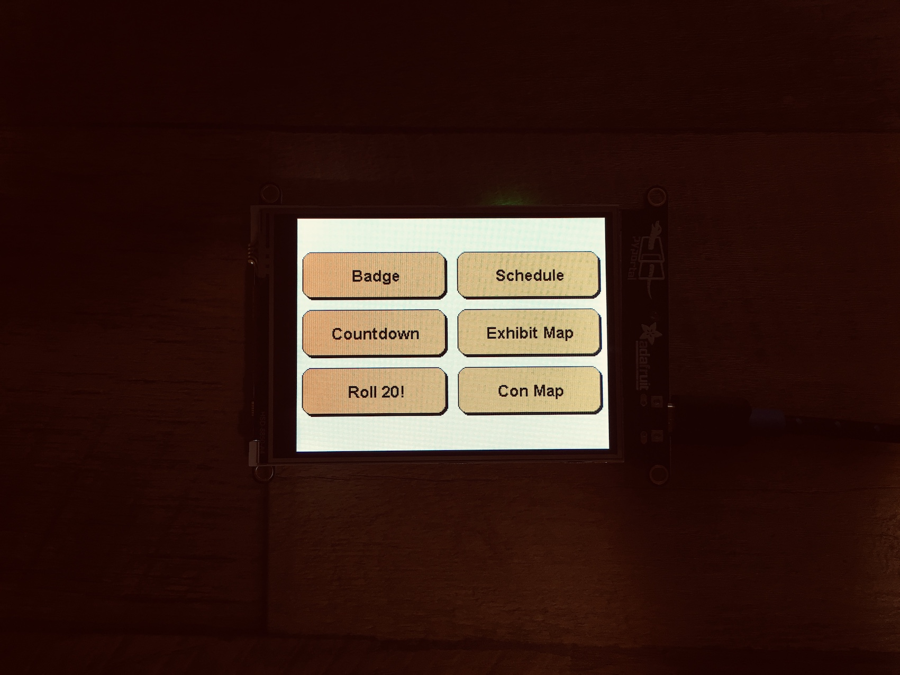

# About

The Gen Con portal is a small project to create a portable badge for 2019. Currently the badge will display a series
of maps related to the Con, a schedule, countdown and D20 roller.

## Acknowledgements

Thank you to the team at Adafruit for creating the PyPortal and CircuitPython. I wouldn't have built this without
their hard work

## Contributing

I would love to hear other ideas for fun badge items at Gen Con. You can find ideas I have or things I'm working
on in the repo issues. Currently the main area of focus is better memory management and profiling so I can let
the badge do more without crashing.

